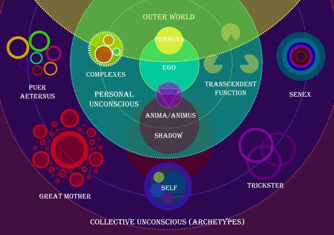

# Symbolic-Self (4-Archetype Core)

**Why** — hallucinations often arise from a single psyche-pole dominating.  
We introduce a 4-pole Jungian loop (Puer, Great Mother, Senex, Trickster) mapped onto Fracton’s Initiator/Shaper/E₃ cycle.

*Self / Shadow polarity* ⇒ explicit drift keywords ⇒ targeted repairs (policies).  
Secondary 12 archetypes act only as utility functions to resolve specific drifts.
